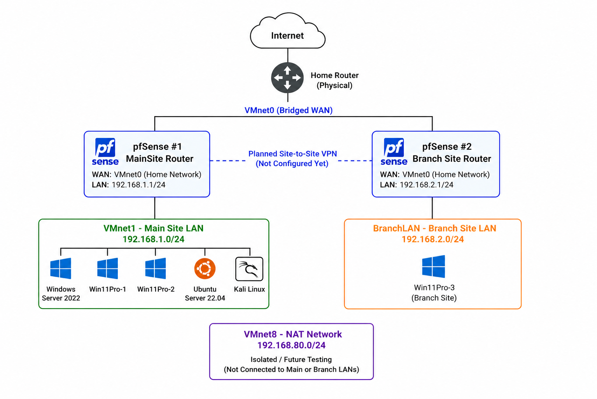

# Network Design

This lab simulates a small multi-site environment with a Main Site LAN, an isolated BranchLAN, a NAT-based security testing segment, and bridged WAN access.

## Network Segments

| Segment | Purpose | Subnet |
| --- | --- | --- |
| VMnet0 | Bridged WAN access through the physical network | Home network |
| VMnet1 | Main Site LAN | 192.168.1.0/24 |
| BranchLAN | Branch office LAN | 192.168.2.0/24 |
| VMnet8 | Isolated testing network | 192.168.80.0/24 |

## Main Site

| Setting | Value |
| --- | --- |
| Router | pfSense #1 |
| LAN IP | 192.168.1.1/24 |
| DHCP scope | 192.168.1.100-192.168.1.199 |
| Domain | lab.local |
| Domain Controller / DNS | 192.168.1.10 |
| Linux infrastructure server | 192.168.1.20 |
| VMware network | VMnet1 |
| VMware DHCP | Disabled |

pfSense #1 routes and serves DHCP for the Main Site. Windows Server 2022 provides Active Directory and DNS for `lab.local`.

## Branch Site

| Setting | Value |
| --- | --- |
| Router | pfSense #2 |
| LAN IP | 192.168.2.1/24 |
| DHCP scope | 192.168.2.100-192.168.2.199 |
| VMware network | BranchLAN |
| VMware network type | LAN segment |

BranchLAN is isolated from the Main Site. Win11Pro-3 remains local-only until site-to-site VPN routing is configured.

## Testing Network

| Setting | Value |
| --- | --- |
| VMware network | VMnet8 |
| Subnet | 192.168.80.0/24 |
| Kali VMnet8 address | 192.168.80.134 |
| Metasploitable 3 address | 192.168.80.133 |

Kali uses a second adapter on VMnet8 to test against Metasploitable 3 without placing the vulnerable target on the Main Site or Branch Site networks.

## Systems

| System | Network | Addressing | Role |
| --- | --- | --- | --- |
| pfSense #1 | VMnet1 / VMnet0 | 192.168.1.1 | Main Site gateway |
| pfSense #2 | BranchLAN / VMnet0 | 192.168.2.1 | Branch gateway |
| Windows Server 2022 | VMnet1 | 192.168.1.10 | Domain Controller and DNS |
| Ubuntu Server | VMnet1 | 192.168.1.20 | Linux infrastructure |
| Win11Pro-1 | VMnet1 | DHCP | Domain-joined workstation |
| Win11Pro-2 | VMnet1 | DHCP | Domain-joined workstation |
| Win11Pro-3 | BranchLAN | DHCP | Branch workstation |
| Kali Linux | VMnet1 + VMnet8 | DHCP / 192.168.80.134 | Testing workstation |
| Metasploitable 3 | VMnet8 | 192.168.80.133 | Vulnerable target |

## Design Decisions

- VMnet1 DHCP is disabled in VMware so pfSense #1 is the only DHCP authority.
- Windows Server uses a static IP so AD and DNS are stable.
- Ubuntu uses a static IP so Docker and logging services can be added later.
- BranchLAN uses a VMware LAN segment to simulate a separate site.
- Win11Pro-3 is intentionally not domain-joined until VPN routing exists.