# Verification Screenshots

Selected screenshots used to verify network segmentation, DHCP behavior, VPN connectivity, domain access, Group Policy, and isolated testing.

## VMware Virtual Networks

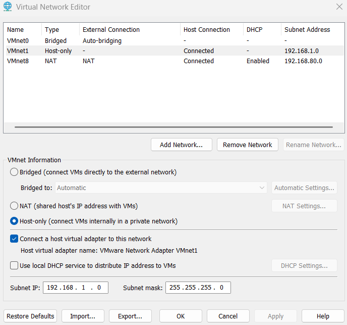

VMnet0 provides bridged WAN access, VMnet1 is MainLAN with VMware DHCP disabled, and VMnet8 is the isolated testing network.

## Main Site DHCP

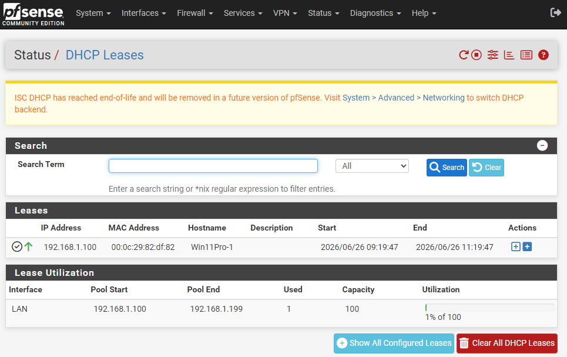

pfSense #1 issued a `192.168.1.x` DHCP lease on MainLAN.

## Branch Site DHCP

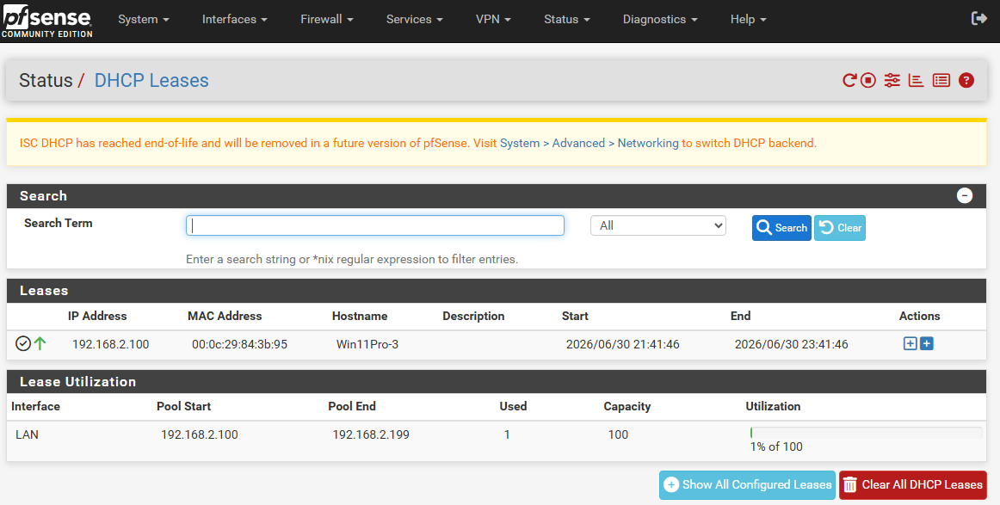

pfSense #2 issued a `192.168.2.x` DHCP lease on BranchLAN.

## Branch Workstation IP Configuration

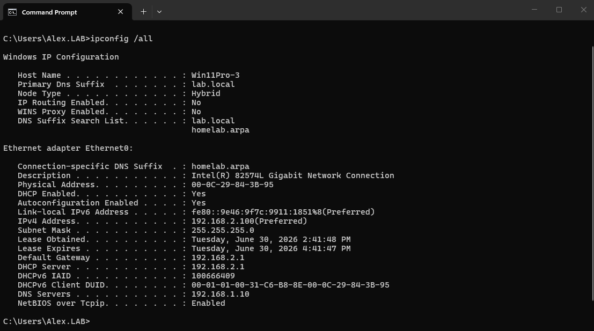

Win11Pro-3 received BranchLAN addressing with `192.168.2.1` as its gateway and `192.168.1.10` as its DNS server.

## IPsec Tunnel Status

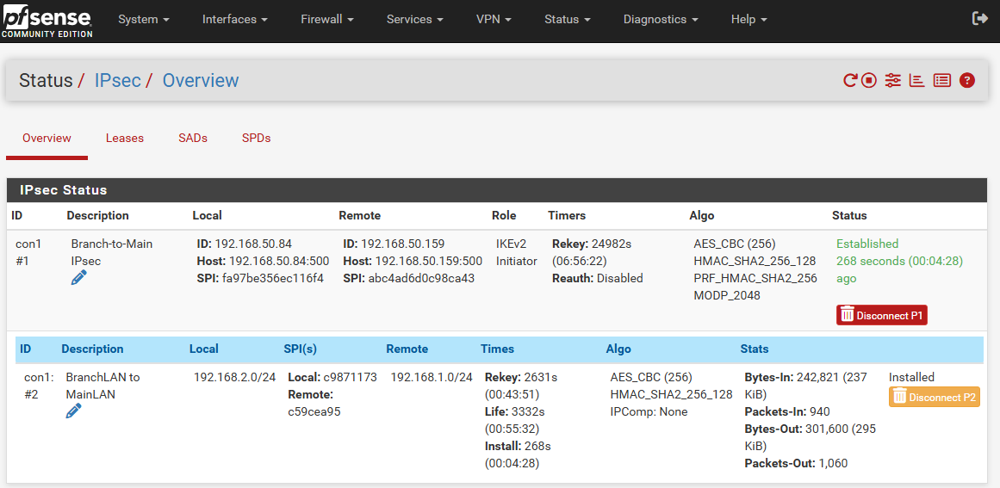

pfSense shows the BranchLAN-to-MainLAN IPsec tunnel as established with Phase 2 installed.

## Branch DNS Validation

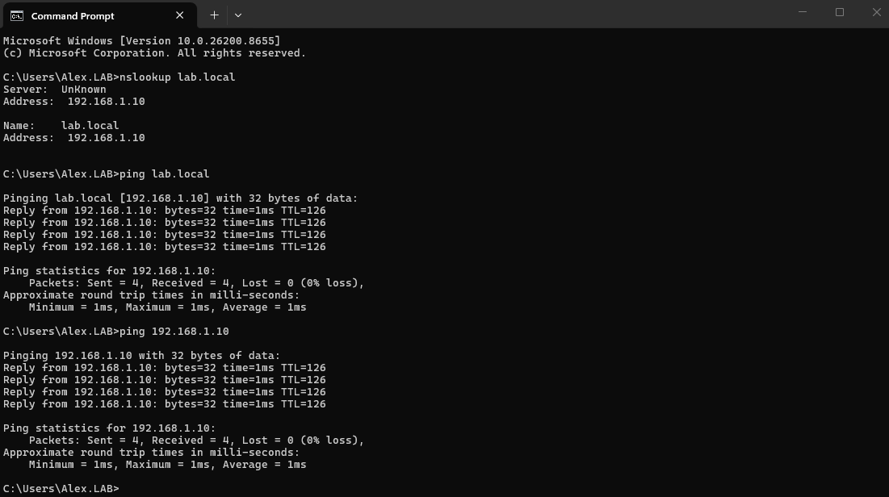

Win11Pro-3 resolved `lab.local` to `192.168.1.10` and reached the Domain Controller across the VPN.

## Branch Domain Validation

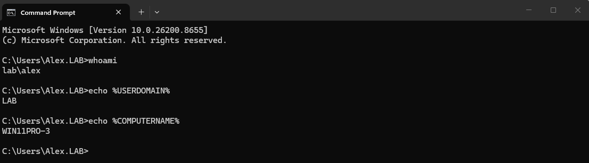

Win11Pro-3 authenticated as `lab\alex` on the `LAB` domain.

## Branch Group Policy Result

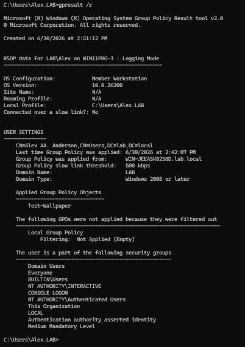

`gpresult /r` confirmed the `Test-Wallpaper` GPO applied to `LAB\Alex` on Win11Pro-3.

## Branch Domain Controller Discovery

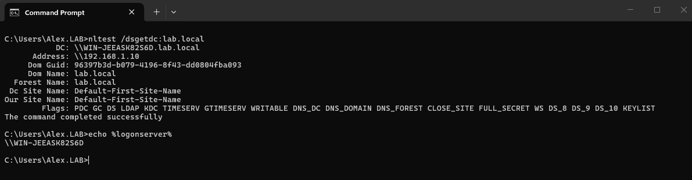

Win11Pro-3 located `WIN-JEEASK82S6D.lab.local` and confirmed `\\WIN-JEEASK82S6D` as the logon server.

## Ubuntu Server Network Verification

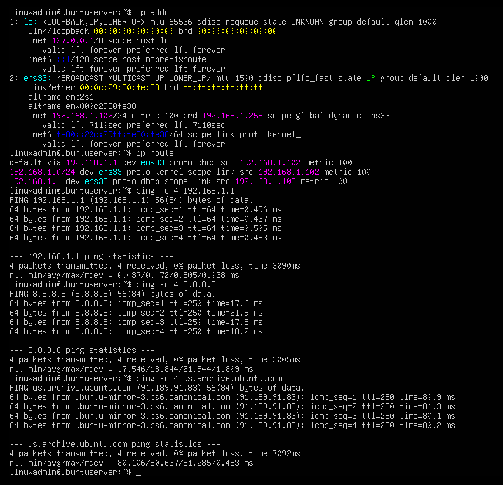

Ubuntu Server confirmed MainLAN addressing, gateway reachability, internet access, and DNS resolution.

## Kali to Metasploitable 3 Reachability

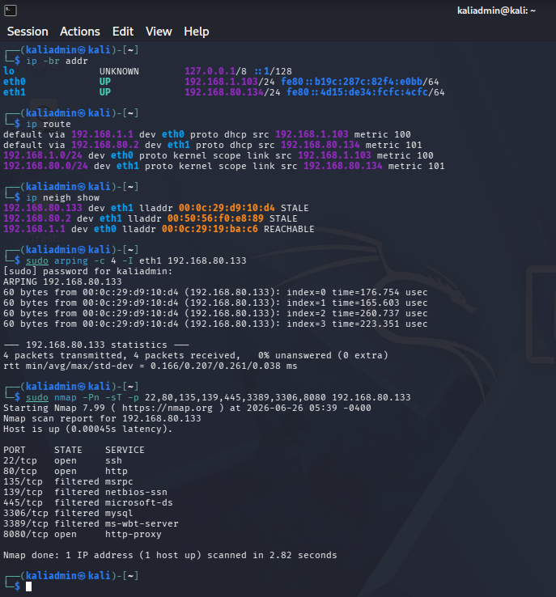

Kali confirmed ARP reachability and TCP service discovery against Metasploitable 3 on VMnet8.